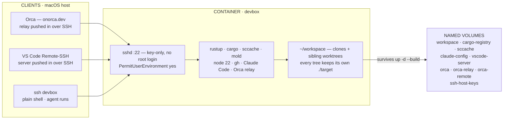
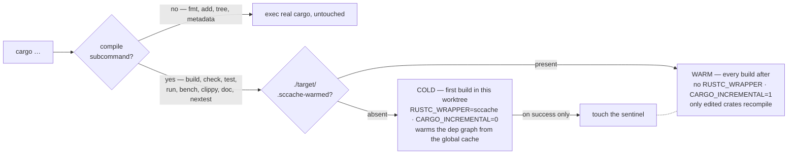

# devbox

A containerized dev environment reachable over SSH, with a persistent
workspace, cargo/sccache caches, and Claude Code/Orca state that survive
rebuilds. It is also the sandbox that makes running agents with approvals
skipped a bounded risk.

[`docs/setup.html`](docs/setup.html) is the same material as a browsable page,
with diagrams — open it locally in a browser. Everything it says is below.

## The shape of it

Nothing of value lives in the image. The image is a toolchain; state lives on
named volumes; work lives in `~/workspace`. Clients attach from outside over
one SSH port.



Host port 2223 forwards to the container's sshd; 3000 is published for the
Next dev server. Port 2222 is deliberately skipped — VS Code's devcontainer
forwarder owns it.

The container's SSH host keys live on a volume rather than in the image.
Image-baked keys are regenerated by every rebuild, so the box would look like a
different machine each time and strict clients (Orca, anything checking
`known_hosts`) would refuse to connect.

sshd probes its clients every 15s (`ClientAliveInterval 15`,
`ClientAliveCountMax 8`). Sessions arrive through the host's port forward, and
every NAT hop in that chain drops idle mappings after minutes — host sleep or
Wi-Fi roaming drops them outright. The probes hold the mapping open, and a peer
that stops answering is reaped in ~2 minutes. Without them sshd sends nothing
and waits out the kernel's `tcp_keepalive_time` (7200s) before noticing, so a
dead session sits wedged for up to two hours. Long-running agent sessions are
what suffer; set the mirror image on the client (step 4 of [Setup](#setup)).

## Preinstalled tooling

Beyond the base toolchain (Rust via rustup, Node LTS, `gh`, `sccache`, `mold`,
`ripgrep`, Claude Code):

| | |
| --- | --- |
| Shell / files | `fd`, `tree`, `bat`, `delta` (git-delta), `lsof`, `nc` (netcat-openbsd), `zstd`, `time` |
| Data | `jq`, `yq` (mikefarah), `sqlite3`, `duckdb` |
| Build / bench | `just`, `hyperfine` |
| Lint | `shellcheck`, `shfmt` |
| Security | `trivy`, `cargo-deny` |
| Cargo | `cargo-nextest`, `cargo-expand`, `cargo-machete` |
| Python / AI | `python3` + `pip` (3.12, `python`/`pip` aliases on PATH), `uv` + `uvx` (Astral), `code-review-graph` (Tree-sitter/MCP review graph) |
| Browser tests | `playwright` (`@playwright/test`) with Chromium and its runtime libraries prebuilt into the image |

Versions are pinned as `ARG`s at the top of the `Dockerfile` for anything not
taken from the Ubuntu archive. `cargo expand` additionally needs a nightly
rustc — run `rustup toolchain install nightly --profile minimal` inside the box.
`pip` installs globally: `/etc/pip.conf` sets `break-system-packages`, so Ubuntu's
PEP 668 guard won't refuse a bare `pip install`. Use a venv or `uv` if you'd rather
keep an environment isolated.

Playwright's browsers live in `/opt/playwright`, not the usual
`~/.cache/ms-playwright`, and `PLAYWRIGHT_BROWSERS_PATH` points every playwright
in the box at it — so `playwright test` runs without a download first, and a
project pinned to a different playwright version fetches just the browser
revision it wants (`playwright install`, no sudo: the directory belongs to
`dev`). Chromium is the only browser in the image; build with
`--build-arg PLAYWRIGHT_BROWSERS="chromium firefox webkit"` for the full set,
at roughly another gigabyte. It runs headless with its own sandbox off, which is
Playwright's default, so none of this asks for the syscall filter to be relaxed
(see [Sandbox](#sandbox)). `shm_size: 1gb` in `docker-compose.yml` is there
because Docker's 64MB `/dev/shm` crashes Chromium mid-run.

## Setup

1. **SSH key.** The container authenticates you with your host's public key,
   read from `~/.ssh/id_ed25519.pub` (see `docker-compose.yml`). If you don't
   already have one:

   ```sh
   ssh-keygen -t ed25519 -C "you@example.com"
   ```

   Accept the default path (`~/.ssh/id_ed25519`) — the compose file mounts
   that exact path read-only into the container on every start.

2. **Env file.** Copy `.env.example` to `.env` and fill in `GH_TOKEN`,
   `GIT_USER_NAME`, `GIT_USER_EMAIL`, `SUDO_PASSWORD`, and
   `CLAUDE_CODE_OAUTH_TOKEN` as needed. `.env` is gitignored.

3. **Claude Code instructions (optional).** To give Claude Code a global
   `CLAUDE.md` inside the box:

   ```sh
   cp CLAUDE_box.example.md CLAUDE_box.md
   ```

   Edit it, then uncomment `CLAUDE_BOX_MD=./CLAUDE_box.md` in `.env`.
   `user-setup.sh` copies the file to `~/.claude/CLAUDE.md` on every start, so
   a change takes a restart rather than a rebuild. `CLAUDE_box.md` is
   gitignored. Uncomment the `.env` line only once the file exists — see
   [Why the path is an `.env` knob](#why-the-path-is-an-env-knob).

4. **Build and start.**

   ```sh
   docker compose up -d --build
   ```

5. **SSH config.** Add a `devbox` host entry so `ssh devbox` just works:

   ```
   Host devbox
       HostName localhost
       User dev
       Port 2223
       IdentityFile ~/.ssh/id_ed25519
       ForwardAgent yes
       ServerAliveInterval 15
       ServerAliveCountMax 8
       StrictHostKeyChecking no
       UserKnownHostsFile /dev/null
   ```

   The container's SSH host key is generated once on first start and kept on
   a volume, so it stays stable across rebuilds — `StrictHostKeyChecking no`
   / `UserKnownHostsFile /dev/null` just avoid local `known_hosts` noise from
   port 2223 being reused by different containers over time.

   `ServerAlive*` is the client half of the keepalive pair sshd sets (see
   [The shape of it](#the-shape-of-it)). Both halves are worth having: the
   server's probes keep the forward's NAT mapping open, and the client's let
   your end notice a dead box in ~2 minutes instead of hanging on it.

   See [Sandbox](#sandbox) before keeping `ForwardAgent yes`.

6. **Connect.**

   ```sh
   ssh devbox
   ```

## What happens on `docker compose up -d`

Two scripts. Root does only what needs root; everything under `/home/dev` is
done by the dev user itself, so no ownership ever has to be repaired.

1. **`entrypoint.sh`** (root) — writes GitHub's host key to
   `/etc/ssh/ssh_known_hosts`, generates the SSH host keys into the volume if
   absent, and sets the sudo password from `SUDO_PASSWORD` or leaves the
   account locked.
2. **`/etc/profile.d/devbox-env.sh`** — every `CARGO_*`, `SCCACHE_*` and
   `RUSTC_WRAPPER` exported for interactive login shells. Root-owned and
   world-readable, which is exactly why no secret goes here.
3. **`user-setup.sh`** (dev) — installs the host pubkey as `authorized_keys`,
   writes `~/.ssh/environment` for non-interactive sessions and
   `~/.config/devbox-env.sh` mode 600 for the tokens, wires `gh` as git's
   credential helper, sets the commit identity, and installs `CLAUDE_box.md`
   as `~/.claude/CLAUDE.md` if `CLAUDE_BOX_MD` points at one.
4. **`sshd -D -e`** — foreground, logging to the container.
   `restart: unless-stopped` keeps the box up across reboots.

### Three ways PATH and env reach a session

| Session | Where it gets its environment |
| --- | --- |
| Interactive login (`ssh devbox`) | `/etc/profile.d/*.sh` plus `~/.bashrc`, which sources `~/.config/devbox-env.sh` |
| Non-interactive (`ssh devbox cargo build`) | `~/.ssh/environment` (needs `PermitUserEnvironment yes`) for the vars; PATH from `/etc/environment`, because pam_env runs *after* sshd reads the environment file and would override it |
| Agents / Orca | Same as non-interactive — which is why the PATH lives in `/etc/environment` and not in a shell rc |

### Secrets and auth

| | |
| --- | --- |
| `GH_TOKEN` | `gh` authenticates with no `gh auth login`; git SSH remotes are rewritten to HTTPS so unattended agents don't need a forwarded agent |
| `CLAUDE_CODE_OAUTH_TOKEN` | Subscription token from `claude setup-token`. Deliberately not `ANTHROPIC_API_KEY` — that would bill API credits instead of the plan |
| `SUDO_PASSWORD` | Unset means sudo is disabled entirely; root work goes through `docker exec -u root devbox`. A runaway process can't silently escalate |
| `GITHUB_KNOWN_HOSTS` | Public data, so it's defaulted in the committed compose file — a fresh clone works without a `.env`. Override it in `.env` if GitHub rotates the key; takes effect on `up -d`, no rebuild |
| `GIT_USER_NAME` / `GIT_USER_EMAIL` | Written to `~/.gitconfig` on every start. Not a secret, but per-user, so it lives in `.env` rather than the committed compose file |
| `CLAUDE_BOX_MD` | Host path to a `CLAUDE.md` copied to `~/.claude/CLAUDE.md` on every start. Unset means the mount falls back to `/dev/null` and nothing is installed |

`~/.gitconfig` is deliberately not on a volume. It is derived state — the
credential helper and the identity are both rewritten from the environment on
every start, so `.env` stays the one place they are set. The cost of getting
this wrong is quiet: a `git config --global` run by hand inside the box works
until the next rebuild, and then every commit fails with `Author identity
unknown`. Agents hit it hardest, since they get the error instead of a prompt.

`~/.claude/CLAUDE.md` works the same way, and for the same reason. That path
*is* on a volume, so a file written there by hand outlives a rebuild and then
quietly disagrees with the host's `CLAUDE_box.md`. Rewriting it on every start
keeps one source of truth; the trade is that in-box edits to it are overwritten
the next time the box comes up. Edit `CLAUDE_box.md` on the host instead.

### Why the path is an `.env` knob

`CLAUDE_box.md` is gitignored, so a fresh clone doesn't have one — and Docker
turns a bind-mount source that doesn't exist into a *directory*. Mounting
`./CLAUDE_box.md` literally would therefore leave a stray `CLAUDE_box.md/`
directory in the repo and install nothing, with no error. Routing the path
through `CLAUDE_BOX_MD` lets the compose file default to `/dev/null`, which is
a character device rather than a regular file, so `user-setup.sh`'s `-f` test
skips it and the feature is simply off until you opt in. It's the same trick
the `GITHUB_KNOWN_HOSTS` default uses: keep a fresh clone working without a
`.env`.

If you do hit it, `rmdir CLAUDE_box.md` and create the file for real.

## Orca remote

Orca connects over the same `devbox` SSH host and pushes a remote component in,
the same shape as VS Code's server. Three volumes keep it from re-uploading and
from losing session state on every rebuild:

| | |
| --- | --- |
| `~/.orca-remote` | The pushed relay binary, one directory per version (`relay-0.1.0+<hash>`). A detached `node relay.js` holds a unix socket and fans out to per-session shells |
| `~/.orca-relay` | Runtime scaffolding: `bin/`, `opencode-overlays/`, and `shell-ready/bash/rcfile` — every Orca terminal is a `bash --rcfile` off that, which is how the box's env reaches Orca sessions |
| `~/.orca` | `sessions/` and `agent-hooks/`, the durable per-session state |

Orca names each workspace after a sea creature, and the box's worktrees carry
those names straight through (`oxygen-internal-axolotl`, `-butterfish`,
`-cowfish`). The suffix tells you which Orca session owns the tree.

## Worktrees

One clone per repo, then a flat fan of sibling worktrees under `~/workspace` —
never nested inside the parent checkout:

```sh
cd ~/workspace/<repo>
git worktree add ../<repo>-<name> -b <branch>
```

```
/home/dev/workspace/
├── oxygen-internal                 [main]                              ← primary clone
│   ├── oxygen-internal-axolotl     orca session
│   ├── oxygen-internal-butterfish  orca session
│   ├── oxygen-internal-cowfish     orca session
│   └── oxygen-internal.worktrees/
└── airlayer                        [feat/driver-contribution-sign]     ← primary clone
```

Indentation shows which clone a worktree belongs to; on disk they are all
siblings in `~/workspace`. The exception to the flat layout is
`<tree>/.claude/worktrees/<name>` — Claude Code makes those for itself, nested
inside whichever tree it was working in.

There is deliberately **no shared `CARGO_TARGET_DIR`**. A shared one made every
cargo invocation in the box serialize on cargo's per-target-dir build lock —
*"Blocking waiting for file lock on build directory"* — which reads as a hang
under agent and non-interactive runs. Each worktree gets its own `./target`;
sccache is what shares work between them, and it does so safely.

## Cargo: the shim, sccache, and mold

sccache and `CARGO_INCREMENTAL` are mutually exclusive — sccache refuses to run
as a rustc wrapper when incremental is on. Their value is temporally disjoint,
though, so `~/.local/bin/cargo` (`cargo-shim.sh`) sits ahead of the real cargo
on PATH and picks one per worktree per phase. It calls the real cargo by
absolute path, so it never recurses.



Subcommand parsing skips flags, `+toolchain`, and values consumed by `-Z`,
`-C`, `--color` and `--config`, so `cargo -Z unstable-options build` is still
recognized as a build. A failed cold build leaves no sentinel, so the next
attempt retries cold. The flip is one-directional by design: toggling
incremental 0↔1 would thrash local-crate fingerprints on every build.

Sharp edges:

- **Warm a worktree with `cargo build`, not `cargo check`.** A cold `check`
  only produces dep `.rmeta`; a later `build` — now with sccache off — would
  have to codegen every dependency from scratch. `build` seeds both.
- **The flip costs a one-time recompile** of your local crates, because
  turning incremental on changes their rustc flags and invalidates their
  fingerprint. Dependencies are unaffected; they are never incremental.
- **Concurrency:** two builds racing in the same worktree before the sentinel
  is written invalidate each other's local fingerprints once. Wasteful,
  harmless.
- `cargo clean` wipes the target dir including the sentinel, so the next build
  correctly starts cold again.

The rest of the build environment:

| | |
| --- | --- |
| `-C link-arg=-fuse-ld=mold` | mold as the linker for aarch64-unknown-linux-gnu, installed from upstream releases because Ubuntu 24.04 ships mold 2.30 from Mar 2024 |
| `CARGO_PROFILE_DEV_DEBUG=0` | No debuginfo in dev builds; the single biggest cut to link time and target-dir size |
| `CARGO_PROFILE_DEV_SPLIT_DEBUGINFO=off` | Nothing to split once debug is off |
| `SCCACHE_CACHE_SIZE=20G` | Global, shared by every worktree and every clean build |
| cargo-registry volume | Downloaded crate sources, kept across rebuilds |

## Volumes: what survives a rebuild, and why it has to

| Volume | Mount | What breaks without it |
| --- | --- | --- |
| `workspace` | `~/workspace` | Every clone, every worktree, every uncommitted change |
| `cargo-registry` | `~/.cargo/registry` | Re-download every crate source from scratch |
| `sccache` | `~/.cache/sccache` | Every worktree's first build goes fully cold — the shared compilation cache is gone |
| `claude-config` | `~/.claude` | Claude Code login and settings. `~/.claude.json` is symlinked into it, so onboarding state and the per-project session index survive too |
| `vscode-server` | `~/.vscode-server` | The VS Code server is re-downloaded on every rebuild |
| `orca`, `orca-relay`, `orca-remote` | `~/.orca*` | Orca re-pushes its remote component and loses session state |
| `ssh-host-keys` | `/etc/ssh/host-keys` | Box looks like a new machine; strict clients refuse to connect |

Mountpoints are pre-created in the image, owned by `dev`. A named volume seeds
itself from the image's content at that path *including ownership*; if the path
is absent from the image, Docker creates it empty and root-owned, and the
entrypoint would have to chown it on every start.

## Sandbox

Agents run in here with `--dangerously-skip-permissions` — no per-tool approval
prompt, which is what makes unattended and parallel runs practical. That is
only a reasonable trade because the container bounds the damage.

**Contained:**

- **The host filesystem.** Exactly one path is mounted from the host,
  `~/.ssh/id_ed25519.pub`, read-only. No source outside the box, no `~/.aws`,
  no keychain, no browser profiles, no dotfiles.
- **Your SSH identity.** Only the *public* key crosses the boundary.
- **Root.** sudo needs `SUDO_PASSWORD`, which is never written into any session
  file; unset, the account is locked and sudo simply refuses.
- **The Docker daemon.** No `/var/run/docker.sock` mount, no `privileged`, no
  added capabilities — no path back out to the host.

**Still in reach:**

- Everything in `~/workspace`, including uncommitted work. The volume outlives
  the container, so `docker compose down` undoes nothing.
- `GH_TOKEN` and its push access — it sits in `~/.ssh/environment` and
  `~/.config/devbox-env.sh`, readable by the `dev` user.
- `CLAUDE_CODE_OAUTH_TOKEN`, i.e. the subscription itself.
- Unrestricted network egress, plus whatever the LAN and host expose to the
  container. Published ports 2223 and 3000 bind on all interfaces.

**`ForwardAgent yes`** is the hole in "the private key never enters the
container": for the life of an `ssh devbox` session the host's SSH agent is
reachable from inside, and any process running as `dev` can sign with your key.
Git doesn't need it — that's what the `GH_TOKEN` credential helper is for — so
drop it if unattended agents run while you're logged in.

The container protects the host, not the work. Nothing here recovers
uncommitted changes from a worktree an agent trashed; that is what the
one-worktree-per-session layout and frequent commits are for.

## Published image

`.github/workflows/docker.yml` builds the image on every push to `main` and
publishes it to Docker Hub as `<DOCKERHUB_USERNAME>/devbox`. Pull requests
build the Dockerfile but push nothing, so a broken build can't replace
`latest`.

`linux/amd64` and `linux/arm64` are built on runners of their own architecture
— the Dockerfile fetches arch-specific upstream binaries (sccache, mold, yq,
trivy, duckdb), and QEMU emulation would turn a build into an hours-long one.
The two per-arch images are pushed by digest only and joined into one
multi-arch tag at the end, so a tag never points at a half-finished matrix.

| Tag | Points at |
| --- | --- |
| `latest` | The most recent `main` |
| `sha-<full commit sha>` | Every pushed commit |
| `<x.y.z>`, `<x.y>` | A pushed `v*` tag |

Two repository secrets are required — **Settings → Secrets and variables →
Actions**:

| Secret | Value |
| --- | --- |
| `DOCKERHUB_USERNAME` | Docker Hub account to publish under — it doubles as the image namespace |
| `DOCKERHUB_TOKEN` | A Docker Hub **access token** (Account Settings → Personal access tokens) with **Read & Write**, not the account password |

The workflow builds the image name from `DOCKERHUB_USERNAME` rather than
hardcoding it, so the target can't drift from the credentials that log in — a
mismatch there surfaces as `insufficient_scope` on push, long after a
successful login. GitHub masks secrets in logs, so the name reads as
`***/devbox` there. Publishing under an organization instead means naming it
explicitly in the two `IMAGE:` values.

The compose file still builds from the local `Dockerfile` — that's the point of
a box you edit. To run the published image instead, drop `build: .` for
`image: <namespace>/devbox:latest` in an override file; everything else
(volumes, ports, env) is unchanged.

## Day to day

On the host:

```sh
ssh devbox                       # in
docker compose up -d --build     # rebuild, keep all state
docker compose restart devbox    # re-run setup (rotated key or token)
docker exec -u root devbox bash  # root, when SUDO_PASSWORD is unset
docker logs -f devbox            # sshd and setup warnings
```

Inside the box:

```sh
cd ~/workspace/<repo>
git worktree add ../<repo>-<name> -b <branch>
cargo build                      # cold once, then incremental
cargo nextest run                # routed by the shim too
sccache --show-stats
cargo clean                      # drops the sentinel → next build cold
```

Rotating a key or token is a `docker compose up -d`, never a rebuild: the host
pubkey is re-read from the bind mount and the env files are rewritten from
scratch on every start.
